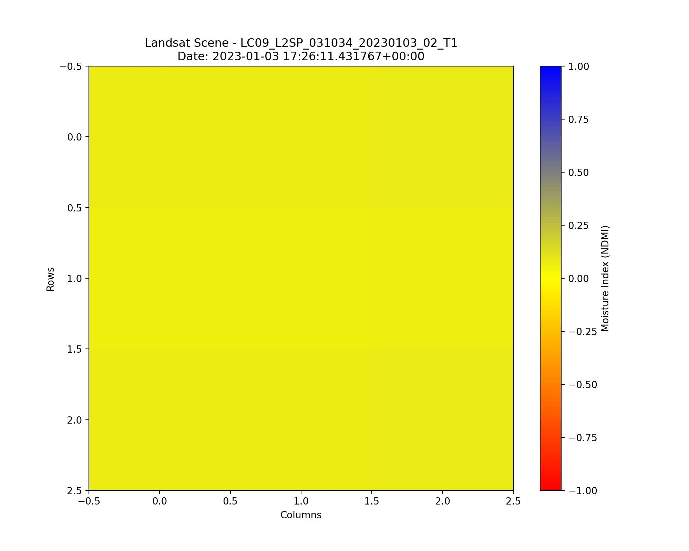
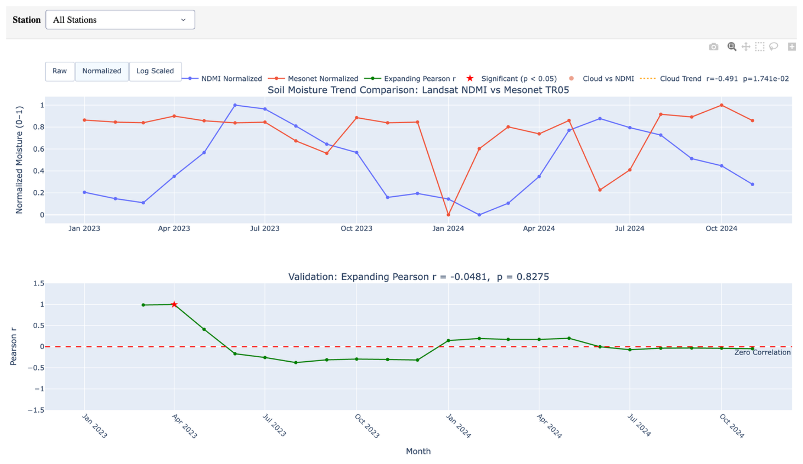

# **Soil Moisture Analysis - Aperture Space**

**Team:** Tejas Phanse, Qian Cheng (Seaqueue), Kumara Swamy Padari  
**Course:** DS 5500 / CS 7980 - Spring 2026, Northeastern University Roux Institute  
**Stakeholder:** Rory Dunn, Aperture Space, Inc.

## What We Are Doing

Building a pipeline that correlates Landsat 8/9 satellite imagery with ground-truth soil moisture measurements from the Oklahoma Mesonet. The goal is to understand how well Landsat-derived NDMI reflects actual soil moisture at 30 meter resolution.

```
NDMI = (Band 5 - Band 6) / (Band 5 + Band 6)
```

## Our Focus

- Accessing Landsat 8/9 imagery via STAC API and AWS S3 without downloading full scene files
- Computing NDMI statistics (mean, min, max) for a given location and date range
- Validating NDMI against Oklahoma Mesonet soil moisture readings

## Highlevel Approach

The pipeline can extract NDMI statistics for any area of interest directly from AWS S3 without downloading full scenes, which keeps processing time low.

Current outputs per location and year:

| Statistic | Description |
|-----------|-------------|
| Mean NDMI | Average moisture across the AOI |
| Min NDMI  | Driest observed pixel |
| Max NDMI  | Wettest observed pixel |

We have also parsed two years of Oklahoma Mesonet data (2023-2024) from 120 stations into a single dataset, and are trying to develope correlation using Pearson method.

**Follow the entire [ProjectPlan.md](ProjectPlan.md) to see our detailed approach**

## Data Sources

| Source | Description |
|--------|-------------|
| Landsat 8/9 (AWS S3) | 30m resolution satellite imagery via STAC API |
| Oklahoma Mesonet | Hourly soil moisture at 121 stations, 2023-2024 |

## File Structure

| File | Description |
| :--- | :--- |
| `landsat_access.py` | This file addresses the entire pipeline from raw data extraction from satellite and using rasterio (transformer, windows) |
| `mositure_analysis.py` | This a dashboard developed with plotly |
| `dataset_comparision.py` | Merges Landsat and Mesonet datasets and performs initial cleaning and statewide EDA. |
| `meso_landsat_norm_EDA.py` | Focuses on interactive station-level visualization with the ability to toggle between raw and normalized sensor data. |
| `mesonet_satation_EDA.py` | Provides comprehensive statewide overview plots and individual station comparisons between TR05 and NDMI. |
| `smoothen_weekly_agg.py` | Implements temporal smoothing (rolling means) and weekly aggregation for more stable trend analysis. |
| `landsat_EDA.py` | Dedicated to exploring the Landsat dataset, specifically handling cloud filters and seasonal patterns. |

## Get Started

Follow these steps to set up the environment and run the soil moisture analysis pipeline:

### 1. Environment Setup

Create the necessary Conda environment and install all dependencies:

```bash
conda env create -f environment.yml
conda activate geo_env
```

### 2. Configuration & AWS Credentials

The pipeline accesses Landsat 8/9 imagery from requester-pays AWS S3 buckets. You must provide your own AWS credentials.

1.  Create an `.env` file in the root directory (you can copy `.env.example` as a template).
2.  Add your AWS credentials:

```bash
AWS_ACCESS_KEY_ID=your_access_key_id
AWS_SECRET_ACCESS_KEY=your_secret_access_key
```

### 3. Running the Pipeline

The project uses a `Makefile` to automate the execution flow. The `make run` command executes the full research pipeline:

```bash
make run
```

1.  **Conditional Extraction:** If `data/scene_links.csv` or `data/moisture_data.csv` are missing, it runs `landsat_access.py` to fetch new satellite data.
2.  **Exploratory Data Analysis (EDA):** Runs all `*_EDA.py` scripts to generate state-wide and station-level visualizations.
3.  **Visualization:** Automatically opens the following key comparative plots:
    - `all_stations_NDMI_14day_roll_norm.html`
    - `all_stations_TR05_14day_roll_norm.html`
4.  **Analysis Dashboard:** Finally, it launches the `mositure_analysis.py` interactive dashboard.

To manually override or run specific parts:

- **Full Setup:** `make setup` (creates the conda environment)
- **Run EDA Only:** `make eda` (runs EDA scripts and opens HTML results)
- **Force Extraction:** `python landsat_access.py`
- **Force Analysis:** `python mositure_analysis.py`

### 4. Key Project Scripts

| Script | Purpose |
|--------|---------|
| `landsat_access.py` | Queries STAC API and computes NDMI stats directly from AWS S3 |
| `mositure_analysis.py` | Correlates NDMI with ground-truth Mesonet soil moisture data with a Dashboard |
| `landsat.py` | Core library for Landsat data processing and band math |

# Results

Below is a visualization of the NDMI and soil moisture changes over time.

## Area of Interest Over Time


*Figure: This GIF illustrates the temporal variation in soil moisture levels at the Eva station. The animation correlates Landsat-derived NDMI statistics, highlighting how the 30-meter resolution imagery captures moisture trends across the landscape, by creating 3x3 matrix covering total of 900m<sup>2</sup> area around a mesonet satation.*

## Dashboard


The analysis is presented through an interactive **Plotly Dash** dashboard (`mositure_analysis.py`). This tool allows for granular exploration of the relationship between satellite NDMI and ground-truth soil moisture.

## 14 Days Rolling NDMI

Seasonality is strong and clean. Nearly all stations trace a bimodal cycle. A primary summer peak (June–August) peaking near normalized values of 0.8–1.0, a winter trough (December–February) near 0.0–0.1, and a secondary spring recovery. The signal reflects actual photosynthetically active vegetation responding to Oklahoma's warm-season growing cycle.

Inter-station coherence is high. Most lines cluster tightly, especially in the summer maxima, suggesting that canopy moisture across Oklahoma broadly follows the same solar radiation and growing degree days. Outliers like the Alva (purple) and Chandler stations show earlier peaks or plateau behavior, consistent with different vegetation types or soil backgrounds.

Year-over-year consistency. The 2023 and 2024 cycles are nearly morphologically identical, NDMI is a relatively stable climatological signal. The 2024 summer peak appears slightly broader, possibly reflecting later senescence.

## 14 Day Rolling TR05


TR05 from the Oklahoma Mesonet represents soil temperature at 5 cm depth (0–5 cm mineral soil layer). This is a near-surface thermal variable driven by both air temperature and soil moisture.

Much noisier and less coherent across stations. Unlike NDMI, TR05 shows substantial inter-station divergence at all times, especially in 2023 winter and transitional periods. This reflects the extreme local heterogeneity of shallow soil: texture, color, organic content, and shading all modulate the 5 cm layer independently.

Seasonality is inverted relative to NDMI. TR05 peaks in summer (July–August), which aligns with NDMI's peak but the key difference is the shoulder season behavior: TR05 rises sharply in spring (March–April), often preceding NDMI's rise, and remains elevated through early fall well after NDMI begins declining.

The 2023–2024 transition is more disrupted in TR05. Several stations show anomalous winter values in early 2024, with TR05 staying elevated near 0.4–0.6 when it should trough. This could reflect winter warm spells or data gaps.

### Key Features:

- **Station Selection:** Filter the analysis for any of the 120 Oklahoma Mesonet stations or view an aggregated statewide trend.
- **Dynamic Normalization:** Toggle between **Raw**, **Min-Max Normalized**, and **Log Scaled** moisture values to compare different mathematical perspectives.
- **Statistical Validation:** Real-time calculation of the **Expanding Pearson Correlation (r)** and **p-values**, with significant correlations (p < 0.05) automatically highlighted.
- **Cloud Impact Analysis:** A dedicated scatter plot correlating cloud cover percentage with NDMI mean, including an OLS trend line to identify potential atmospheric biases.


## Conclusion
- NDMI is a surface spectral index, it captures canopy/surface water content as seen from space, heavily influenced by vegetation state, cloud contamination, and seasonal greenness.

- TR05 at 5cm is subsurface soil dielectric measurement, it responds to precipitation events, drainage, and soil texture, not surface spectral reflectance.

- Normalization makes the two datasets easier to compare because NDMI and Mesonet soil moisture originally use different units and value ranges. After scaling, you can see that the two variables sometimes move in similar directions, but the relationship is not consistent across the full time period. 

- These two will almost never correlate strongly on a monthly basis, this is proved by Pearson correlation, which remains close to zero overall, indicating weak agreement between the two datasets.

- **Seasonality Factor (NDMI)**: As visualized in the 14-day rolling normalized plots (`all_stations_NDMI_14day_roll_norm.html`), NDMI follows a dominant and consistent seasonal cycle across all stations, peaking in spring/early summer and declining in late summer/winter. This predictable "greenness" signal often overrides short-term moisture fluctuations.

- **Seasonality Factor (TR05)**: The corresponding 14-day rolling normalized plots for ground truth (`all_stations_TR05_14day_roll_norm.html`) reveal a more erratic and "spiky" seasonal pattern. Unlike the smooth curve of NDMI, TR05 is characterized by sharp increases following precipitation events and rapid declines during dry periods, reflecting the high sensitivity of the top 5cm of soil to immediate weather conditions.

- **Hypothesis on Signal Offset**: We hypothesize that the observed offset and weak correlation are due to a **"Vegetative Buffering" effect**. While TR05 responds instantly to rain and evaporation at the subsurface level, NDMI measures the hydration state of the vegetation canopy. This creates a temporal lag where plants may take days to "green up" after a rain event or remain hydrated by tapping deeper soil layers even after the 5cm surface layer has dried out, leading to mismatched peaks and troughs between the two datasets.

You can view our Final Presentaion to view our finding in detail

**[Final Presentation](https://canva.link/iuj1gq8oyva98fe)**

