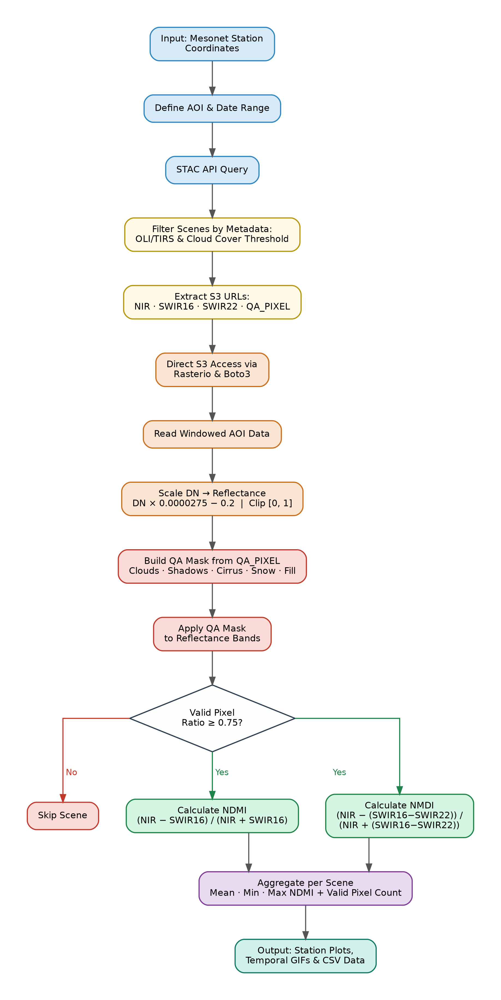
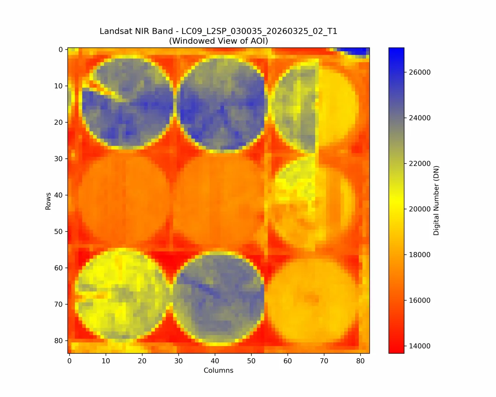

# Correlating Landsat-Derived NDMI with Ground-Truth Soil Moisture: A Validation Study Using the Oklahoma Mesonet

**Tejas Phanse, Qian Cheng, Kumara Swamy Padari**

DS 5500 / CS 7980, Spring 2026, The Roux Institute, Northeastern University

Stakeholder: Rory Dunn, Aperture Space, Inc.

## Abstract

Soil moisture matters for agriculture, drought monitoring, and flood prediction, but estimating it at high resolution from satellites is still an open problem. Existing products like SMAP (9 to 36 km) and Sentinel-1 (1 km) are too coarse for field-level use. This project builds a pipeline that correlates Landsat 8/9 NDMI (Normalized Difference Moisture Index) with soil moisture readings from the Oklahoma Mesonet, a network of 120+ stations that has been recording soil water content at 5, 25, and 60 cm depths since 1994. The pipeline pulls Landsat imagery from AWS S3 through the STAC API without downloading full scenes, computes NDMI from Band 5 (NIR) and Band 6 (SWIR) after applying cloud masking with the QA pixel band, and matches the results to Mesonet readings on Landsat overpass dates. Across all 120 stations for 2023-2024, the pipeline processed 18,215 Landsat scenes and produced 18,213 paired observations. This work was done for Aperture Space, who needs a way to check satellite moisture estimates against ground measurements at 30 m resolution.

## I. Introduction

Soil moisture affects how rainfall turns into runoff or soaks into the ground, how much water crops can access, and how likely flooding is after a storm. The World Meteorological Organization lists it as an Essential Climate Variable.

Measuring soil moisture over large areas at fine resolution is hard. Ground stations like the Oklahoma Mesonet give accurate point readings but are sparse: one station covers one spot, not the whole landscape around it. Satellites cover more ground but at coarse resolution. SMAP gives soil moisture at 9 to 36 km. Sentinel-1 SAR reaches 1 km. Neither is fine enough for field-scale work.

Landsat 8 and 9 give free multispectral imagery at 30 m resolution every 16 days. From the NIR (Band 5) and SWIR (Band 6) bands, you can compute NDMI, which responds to moisture in vegetation and soil. But as Zhang and Liang [11] noted, Landsat has rarely been tested for soil moisture validation against dense ground networks.

This project was started for Aperture Space, a startup in the Roux Institute's Climate Tech Incubator that is building new satellite sensors for soil moisture. They need to know how well existing satellite data matches what ground sensors actually measure. Their question to us was simple: how well does Landsat correlate with real soil moisture? This report covers the pipeline we built, the data we used, what we found so far, and what comes next.

## II. Problem Statement

No one has systematically tested how well Landsat NDMI at 30 m correlates with ground-measured soil moisture from a dense station network over multiple years. SMAP works at 9 to 36 km. Sentinel-1 reaches 1 km. Neither has been validated against the Oklahoma Mesonet using Landsat optical data.

Our research question: how accurately can Landsat NDMI predict soil moisture as measured by the Oklahoma Mesonet?

The project started with a focus on Sentinel-1 and Sentinel-2 per the original project description. After talking with our stakeholder Rory Dunn at Aperture Space, we shifted to Landsat because it is free, covers the whole state at 30 m, and matches the resolution Aperture needs for calibration. Rory provided the Mesonet data and pointed us to the Zhang and Liang (2022) paper [11] as a reference.

## III. Related Work

### SAR-Based Soil Moisture Retrieval

Most soil moisture research from satellites uses Synthetic Aperture Radar. Balenzano et al. [1] validated a Sentinel-1 product at 1 km against 167 ground stations in Europe, America, and Australia (2015 to 2020). They used a Short Term Change Detection algorithm on C-band VV and VH polarization data. One finding relevant to our work: the mismatch between a point sensor on the ground and a satellite pixel overhead is a real source of error in any validation study.

Fan et al. [3] built a global 1 km soil moisture product from Sentinel-1 for 2016 to 2022 and got an unbiased RMSD of 0.077 m3/m3. Rahmati et al. [6] reviewed ten years of Sentinel-1 retrieval work and found AI methods promising but limited by interpretability and compute cost. They suggested combining Sentinel-1 with optical sensors. Peng et al. [5] made the same point in a broader roadmap paper: no single sensor does it all. Das et al. [2] showed what multi-sensor fusion looks like in practice by merging SMAP and Sentinel-1, getting about 0.05 m3/m3 RMSE at 1 to 3 km.

### Optical and Landsat Approaches

Zhang and Liang [11] used Landsat 8 with Random Forest and XGBoost to estimate soil moisture at 30 m. They trained on 1,154 stations from the International Soil Moisture Network. Their paper is the closest to what we are doing, but they trained globally and did not validate against the Oklahoma Mesonet.

Sadeghi et al. [7] used Sentinel-2 with the OPTRAM model and got r = 0.73 to 0.80 for soil moisture using NDMI and NDVI. El Hajj et al. [10] combined Sentinel-1 and Sentinel-2 at 1 km using neural networks and Water Cloud Model simulations, and got better results than either sensor alone. Ghasemloo et al. [12] did something similar with Landsat 8 NDVI and Sentinel-1 SAR through neural networks, confirming that optical plus radar beats either one by itself.

The NDMI formula we use comes from Gao [14], who proposed it in 1996 as NDWI using NIR and SWIR bands to detect water in vegetation. For Landsat 8/9, the USGS defines it as (Band 5 minus Band 6) / (Band 5 plus Band 6) [13]. Published studies report NDMI R-squared values between 0.60 and 0.85 for moisture estimation.

### Ground-Truth Validation

The Oklahoma Mesonet has been running since January 1994 with 120+ stations in all 77 Oklahoma counties [4]. Stations measure soil moisture at 5, 25, and 60 cm depths every 30 minutes using Campbell Scientific CS229L heat dissipation sensors. Zamora et al. [9] used Mesonet data alongside SMAP and the Noah land surface model in a triple-collocation study, confirming it as a reliable ground truth source.

Scott et al. [8] built a soil property database for the Mesonet stations with sand, silt, clay percentages, bulk density, and van Genuchten water retention parameters at each site.

### Gap

Zhang and Liang [11] showed Landsat plus ML works for soil moisture, but they did not test against the Oklahoma Mesonet. Most other validation work uses Sentinel-1 or Sentinel-2, not Landsat. Nobody has taken Landsat NDMI at 30 m and correlated it with Mesonet ground readings over multiple years. That is what we are doing.

## IV. Proposed Approach

The pipeline has three parts: getting Landsat data, getting Mesonet data, and matching them. Figure 1 shows the full workflow.

*Figure 1: Pipeline workflow from Mesonet station coordinates to NDMI output. The pipeline queries the STAC API, reads bands from S3, applies cloud masking, checks valid pixel ratio, and computes NDMI per scene.*

### Landsat NDMI

We pull Landsat 8/9 Collection 2 Level-2 surface reflectance data from AWS S3 through the STAC API (earth-search.aws.element84.com). The user gives an area of interest as a GeoJSON polygon and a date range. The pipeline queries the STAC catalog for scenes in the landsat-c2-l2 collection, filters by OLI/TIRS instrument and cloud cover, and reads Band 5 (NIR, 0.86 um) and Band 6 (SWIR1, 1.6 um) directly from S3 without downloading anything. Scale factor (0.0000275) and offset (-0.2) are applied. Clouds are masked using QA pixel bits for fill, dilated cloud, cirrus, cloud, shadow, and snow. Scenes with less than 75% valid pixels after masking are dropped. Then NDMI is computed:

**NDMI = (Band 5 - Band 6) / (Band 5 + Band 6)**

Output is mean, min, and max NDMI per location per year.

### Oklahoma Mesonet

Mesonet soil moisture from 120 stations (2023-2024) is sourced from mesonet.org. Stations record water content at 5 cm (TR05), 25 cm (TR25), and 60 cm (TR60). We use TR05 because satellite indices mostly respond to moisture near the surface.

### Matching

For each Mesonet station, we find Landsat scenes that cover that station's coordinates on their overpass dates. We extract the NDMI pixel value at the station location using a 3x3 pixel window and pair it with the daily average TR05 reading from the same date. This gives us (NDMI, TR05) pairs we can run correlation on.

## V. Experimental Setup

### Datasets

| Dataset | Resolution | Period | Source |
|---------|-----------|--------|--------|
| Landsat 8/9 L2 | 30 m | 2023-2024 | AWS S3 via STAC API |
| Oklahoma Mesonet | Point (120 stations) | 2023-2024 | mesonet.org |

### Implementation

Written in Python. Main libraries: rasterio and rioxarray for raster data, pystac-client for STAC queries, boto3 for S3 access, geopandas for spatial work, numpy for computation, and plotly/folium for maps. AWS credentials sit in a .env file loaded by python-dotenv. The code has separate scripts: coordinate_extraction.py picks the area of interest, landsat_access.py finds available scenes and computes NDMI, and mositure_analysis.py shows results on a dashboard. A Makefile automates the pipeline: `make run` checks if data files exist and either runs extraction or analysis accordingly.

Setup uses a conda environment from environment.yml. Runs on a regular laptop, no GPU needed.

### Evaluation

We compute Pearson correlation between NDMI and Mesonet TR05 values, make scatter plots, and break results down by season to check if the correlation holds year-round or only in certain months.

## VI. Results and Discussion

### Pipeline Output

The NDMI pipeline works end-to-end across all 120 Oklahoma Mesonet stations. For 2023-2024, the pipeline processed 18,215 Landsat scenes and produced 18,213 paired NDMI observations. For each station, the pipeline queried the STAC API, fetched scene links, applied cloud masking, and computed NDMI. Figure 2 shows the raw NIR band from one scene near Goodwell, where center-pivot irrigation fields are clearly visible.

*Figure 2: Landsat 9 NIR band (Band 5) for the Goodwell area showing center-pivot irrigation fields. The circular patterns with higher DN values (blue) indicate irrigated cropland, while surrounding areas (red/orange) are dry grassland.*

Temporal GIFs were generated for each station showing how NDMI changes over time across all available scenes.

### Mesonet Data

Mesonet statewide hourly data for 2023-2024 from 120 stations was loaded from mesonet.org. Each station reports TR05 (soil moisture at 5 cm depth) along with TR25 and TR60 readings. Some stations have missing TR05 values, which were excluded from analysis. Time series for stations across the state show seasonal patterns: wetter in spring, drier in late summer, matching Oklahoma rainfall.

### Dashboard

The analysis dashboard built with Plotly Dash shows a normalized comparison of NDMI and Mesonet TR05 over time, along with an expanding Pearson correlation that tracks how the agreement between the two signals changes as more data accumulates. Figure 3 shows the dashboard output for all stations.

*Figure 3: Dashboard showing normalized NDMI (blue) and Mesonet TR05 (red) over 2023-2024 for all stations. The bottom panel shows the expanding Pearson r, which stays near zero (r = -0.0481, p = 0.8275), indicating weak agreement between the two datasets on a monthly basis.*

### Limitations

Landsat passes every 16 days and clouds knock out some of those passes, which limits how many usable scenes we get per station. Mesonet records every 30 minutes, so matching requires finding the reading closest to each overpass time.

There is also the point-vs-pixel issue that Balenzano et al. [1] described: one Mesonet sensor is a point measurement while one Landsat pixel covers 30 m by 30 m. The sensor may not represent the whole pixel. This is a known problem in satellite validation work.

NDMI is a surface spectral index that captures canopy and surface water content as seen from space. TR05 at 5 cm is a subsurface soil measurement that responds to precipitation, drainage, and soil texture. These two quantities measure different things, which limits how strongly they can correlate.

## VII. Conclusion

We built a pipeline for Aperture Space that pulls Landsat NDMI from AWS S3 and compares it with Oklahoma Mesonet soil moisture readings from 120 stations. The pipeline processed 18,215 scenes across all stations for 2023-2024 and produced 18,213 paired observations. Temporal GIFs were generated for each station showing NDMI changes over time.

The dashboard shows that on a monthly basis, NDMI and TR05 do not correlate strongly. This makes sense because NDMI measures surface reflectance while TR05 measures subsurface soil moisture — they respond to different physical processes. Future work could add other spectral indices, Land Surface Temperature from the thermal band, or ML models like the Random Forest and XGBoost approach in Zhang and Liang [11].

Aperture Space can reuse this pipeline for their own sensors once they launch, using the same Mesonet data to check their measurements.

## References

[1] A. Balenzano et al., "Sentinel-1 soil moisture at 1 km resolution: a validation study," Remote Sensing of Environment, vol. 263, 112554, 2021.

[2] N. N. Das et al., "The SMAP and Copernicus Sentinel 1A/B microwave active-passive high resolution surface soil moisture product," Remote Sensing of Environment, vol. 233, 111380, 2019.

[3] D. Fan et al., "A Sentinel-1 SAR-based global 1-km resolution soil moisture data product: Algorithm and preliminary assessment," Remote Sensing of Environment, vol. 318, 114579, 2025.

[4] R. A. McPherson et al., "Statewide monitoring of the mesoscale environment: A technical update on the Oklahoma Mesonet," J. Atmospheric and Oceanic Technology, vol. 24, no. 3, pp. 301-321, 2007.

[5] J. Peng et al., "A roadmap for high-resolution satellite soil moisture applications," Remote Sensing of Environment, vol. 252, 112162, 2021.

[6] M. Rahmati et al., "Soil moisture retrieval from Sentinel-1: Lessons learned after more than a decade in orbit," Remote Sensing of Environment, vol. 317, 114505, 2025.

[7] M. Sadeghi et al., "Retrieving soil moisture in rainfed and irrigated fields using Sentinel-2 observations and a modified OPTRAM approach," Int. J. Applied Earth Observation, vol. 89, 102113, 2020.

[8] B. L. Scott et al., "New soil property database improves Oklahoma Mesonet soil moisture estimates," J. Atmospheric and Oceanic Technology, vol. 30, no. 11, pp. 2585-2595, 2013.

[9] R. J. Zamora et al., "Triple collocation of ground-, satellite- and land surface model-based surface soil moisture products in Oklahoma," Remote Sensing, vol. 15, no. 13, 3450, 2023.

[10] M. El Hajj et al., "Soil moisture estimates at 1 km resolution making a synergistic use of Sentinel data," Hydrology and Earth System Sciences, vol. 27, pp. 1221-1242, 2023.

[11] Y. Zhang and S. Liang, "Soil moisture content retrieval from Landsat 8 data using ensemble learning," ISPRS J. Photogrammetry and Remote Sensing, vol. 185, pp. 32-47, 2022.

[12] N. Ghasemloo et al., "Estimating the Agricultural Farm Soil Moisture Using Spectral Indices of Landsat 8, and Sentinel-1, and Artificial Neural Networks," J. Geovisualization and Spatial Analysis, vol. 6, 19, 2022.

[13] USGS, "Normalized Difference Moisture Index," Landsat Missions. Available: https://www.usgs.gov/landsat-missions/normalized-difference-moisture-index

[14] B. Gao, "NDWI: A normalized difference water index for remote sensing of vegetation liquid water from space," Remote Sensing of Environment, vol. 58, no. 3, pp. 257-266, 1996.
